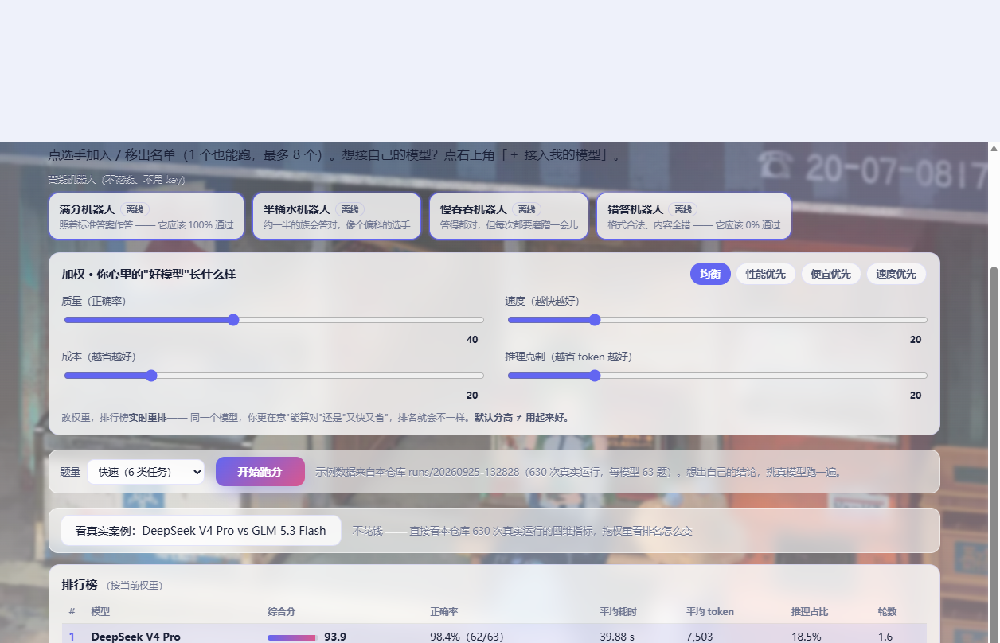
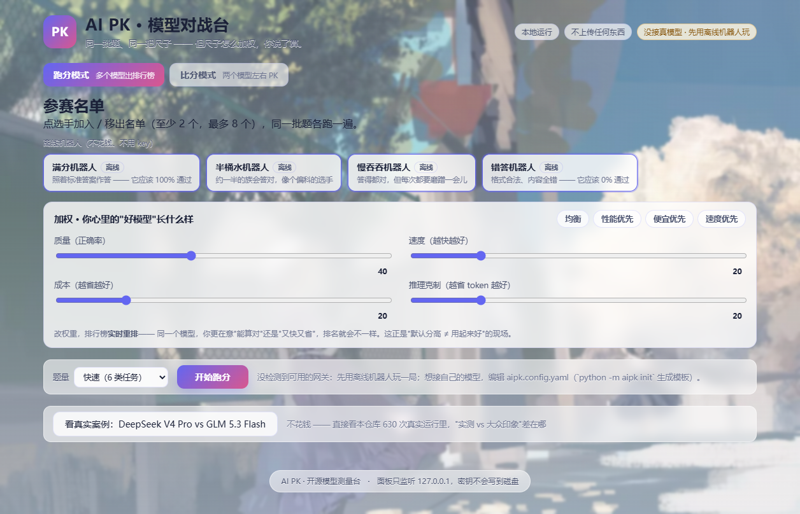
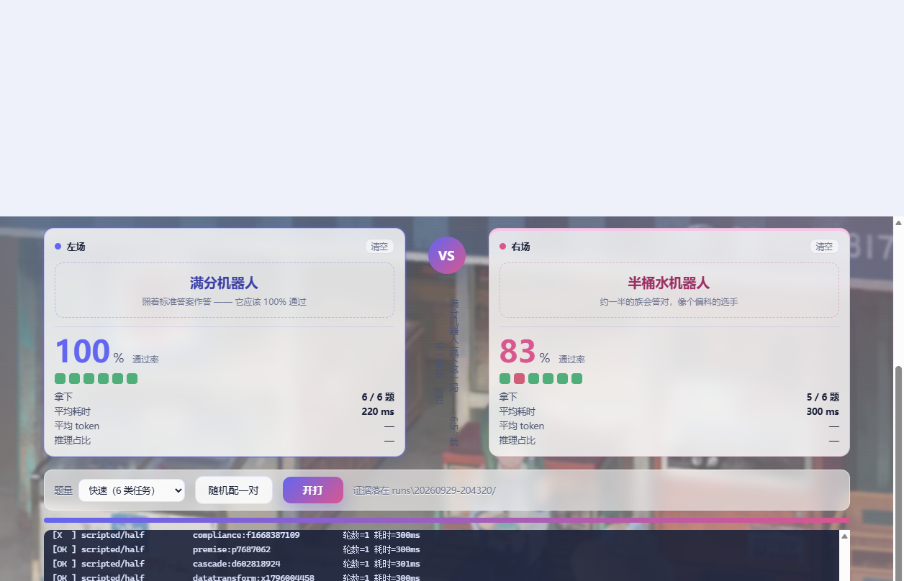
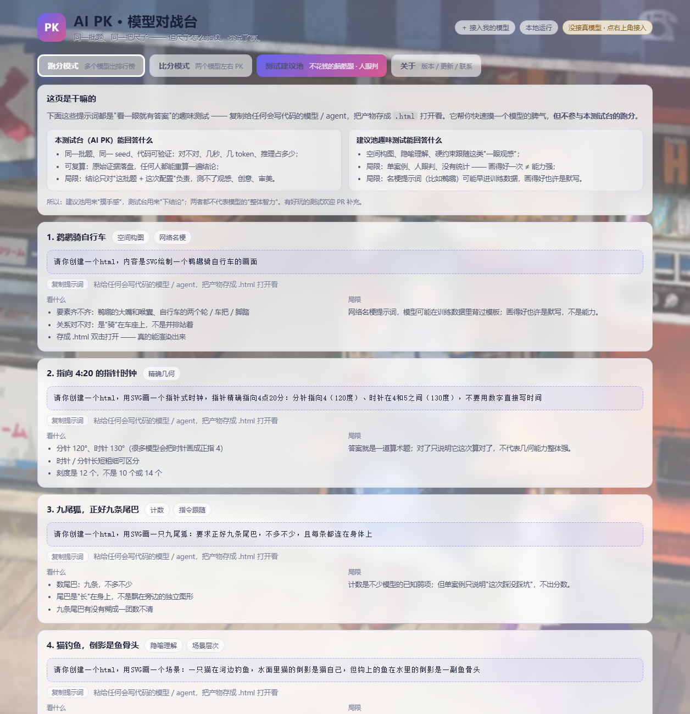
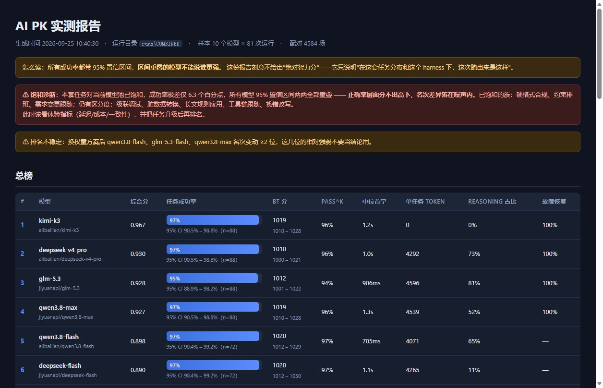

<div align="center">

<b>中文</b> | <a href="README_en.md">English</a>



# AI PK · 模型对战台

**同一批题、同一把尺子 —— 但尺子怎么加权，你说了算。**


此项目只为了解决一件事：**用贴合使用者体验的方式来测试模型性能。**

它不排座次、不追榜单 —— 榜单只告诉你"谁分数高"，不告诉你"多快、多贵、多稳、换个壳子差多少"。
此项目就是把这几个每天都要付账的差别量出来，并且让任何人都能自己复算一遍。

</div>

---

## 功能

| | 功能 | 说明 |
|---|---|---|
| 🎮 | **对战台面板 · 两种模式** | 双击 `启动对战台.bat`（或 `python -m aipk panel`）打开本地网页。**跑分模式**（进页默认）挑 1~8 个选手出加权排行榜，多提交自动**排队**；**比分模式**把两个选手拖进左右场地 PK 出胜方。另有「关于」页看版本 / 检查更新 / 联系作者 |
| 💡 | **测试建议池** | "看一眼就有答案"的脑筋题提示词（SVG 鹈鹕骑自行车、纯 CSS 囚徒困境等）：一键复制、每条附"看什么 / 局限"，并声明趣味测试与本测试台跑分各自的边界 |
| 🎚️ | **自定义加权** | 质量 / 速度 / 成本 / 推理占比四个维度，预设（均衡 / 性能优先 / 便宜优先 / 速度优先）+ 滑块可调；改权重，排行榜**实时重排**。"默认分高 ≠ 用起来好"，权重一变排名就变 |
| 🔑 | **接自己的模型** | 右上角「＋ 接入我的模型」给出 3 步指引和配置模板；密钥走环境变量，不落盘 |
| 🖥️ | **命令行 PK** | `python -m aipk run` 一条命令跑完 (模型 × 任务族 × 重复次数)，产出 HTML / Markdown / `summary.json` 三种报告 |
| 🧩 | **13 类任务** | 约束排班、工具链跟随、级联调试、脏数据转换、硬格式合规、多轮需求变更、长文规则、找错改写、小仓库调试、长程状态、前提辨识、最小 diff、长会话一致性 |
| ⚖️ | **代码判定优先** | 能用代码判的绝不请裁判（跑真代码、AST 语义比对、工作区快照）；只有开放式文本才盲评，并且必须交换位置双评、报告翻转率 |
| 🧰 | **壳子也能测** | 同一个模型换不同 harness（含真实 agent CLI）跑同一批题，直接比出"壳子"带来的差别 |
| 📁 | **证据全落盘** | 每次运行的原始记录、每题判词、报告都留在 `runs/<时间戳>/`，报告可以从记录离线重算 |
| 🔌 | **离线可玩** | 不配网关、不花一分钱，也能用 4 个离线机器人把全链路跑通（满分 / 半桶水 / 慢吞吞 / 错答） |
| 🔐 | **不碰你的密钥** | 密钥只从环境变量或凭据文件读，不落盘、不上传；面板只监听 `127.0.0.1` |

## 注意事项

特地把要紧的写在前面，能省很多时间：

1. **跑真模型必须限速**（默认 `--qps 1.2`）。不限速会被网关 429 打成"假 0 分"，看起来像模型变笨，其实是队列问题。
2. **别同时跑两局。** 两个 run 一起压同一个网关，一样会触发限流。
3. **分阶段任务要放宽轮数。** `decay` / `longstate` 用 `--max-turns 40` 起步，否则会话被截断 —— 那是被截断，不是模型漂移。
4. **结论只说这一次。** 口径永远是"在 seed=X、配置=Y 的这次运行里"，**不说"模型 X 整体更强"**。
5. **离线机器人的延迟是脚本模拟的**，它们只用来验证"这把尺子准不准"，不代表任何模型的真实水平。
6. **面板跑出来的东西是真跑的**：选真模型会真的花钱（按你的网关计费），跑之前先看一眼选手卡上的提示。

## 安装

### 你需要

- Python 3.10 或更高（开发环境 3.12；CI 同时跑 3.10 和 3.12）
- 两个依赖：`httpx`、`pyyaml`。**不需要 GPU、不需要 torch、不需要 API key**

### 两步装好

```bash
git clone https://github.com/xmyl-153/ai-pk && cd ai-pk
pip install -r requirements.txt
python -m aipk demo          # 离线跑通全链路，先确认装置是好的
```

Windows 用户也可以直接双击 **`启动对战台.bat`**，它会用默认端口起面板并自动打开浏览器。

### 接自己的网关（可选；不接也能玩离线局）

复制 `aipk.config.yaml.example` 为 `aipk.config.yaml`（或跑 `python -m aipk init` 生成模板），填上任何 OpenAI 兼容端点：

```yaml
providers:
  mygateway:
    base_url: https://api.example.com/v1
    api_key_env: MY_GATEWAY_API_KEY     # 密钥走环境变量，别写进文件再提交
roster:
  - [mygateway, strong-model, "某旗舰", flagship]
  - [mygateway, fast-model,   "某轻量", light]
```

填完跑 `python -m aipk list` 确认读到了，面板里的"接进来的模型"就会亮起来。

### 包与常见坑

- **依赖真的只有两个**：装不上基本是网络问题，加个国内镜像源即可。
- **网关不报 usage**：token 会用字符数估算，报告里带 `≈` 标记，别当成精确账单。
- **网关 400「不支持 temperature」**：这类参数错误不会被算成模型答错，程序会自动降级重投，并在报告里标「参数降级」。
- **端口被占用**：面板会自动往后找可用端口，看启动时打印的地址即可。
- **`runs/` 不会进仓库**（`.gitignore` 已排除）：它只存在你本机，随时可删。

## 用法

### 一、先玩面板（不用配置、不花钱）

```bash
python -m aipk panel          # 或双击 启动对战台.bat
```

浏览器会自动打开 `http://127.0.0.1:8771/`（端口被占会自动往后找）。进页默认是**跑分模式**：

**跑分模式** —— 1~8 个模型出加权排行榜：
1. 在**参赛名单**里点选手加入 / 移出（**1 个也能跑**，最多 8 个）；
2. 选**加权**：点预设（均衡 / 性能优先 / 便宜优先 / 速度优先）或拖四个滑块（质量 / 速度 / 成本 / 推理占比）；
3. 选题量，点**开始跑分**。**提交多局会自动排队**（一次只跑一局，避免一起压网关触发限流）；跑完出排行榜，**改权重实时重排**，不用重跑。
4. 没网关也能看：点**「看真实案例」**，从本仓库 630 次真实运行（10 模型 × 63 题）里**随机抽 2 个模型**看四维指标，拖权重看排名怎么变；再点一次换一对。

**比分模式** —— 两个模型左右 PK：拖进左 / 右场地（或点卡片再点场地），点**开打**，出比分、逐题对错格子和一句判词（打平时自动比速度和账单）。

**关于页** —— 看版本号、**检查更新**、联系作者（Issue / PR）。

**测试建议池** —— 复制脑筋题提示词（如 SVG 鹈鹕骑自行车）粘给任何会写代码的模型；每条附"看什么"和"局限"。定位说清楚：建议池用来**摸手感**，跑分用来**下结论**，两者都不代表"整体智力"。

**接自己的模型**：点右上角「＋ 接入我的模型」，按 3 步指引填 `aipk.config.yaml`（密钥走环境变量）。跑真模型会真花钱，离线机器人不花钱。

### 二、命令行速查

```bash
python -m aipk selfcheck                    # 装置自检：标准答案必须被判对
python -m aipk demo                         # 离线全链路（满分机器人 100%、错答 0%）
python -m aipk preview --family repofix     # 看一道题长什么样
python -m aipk init                         # 生成配置模板
python -m aipk run --reps 3 --tasks-per-family 3 --qps 1.2 --workers 6
python -m aipk report --run runs/<时间戳>    # HTML + Markdown + summary.json
```

### 三、跑一局真模型的完整流程

1. `python -m aipk list` —— 确认网关和名单读到了；
2. `python -m aipk smoke --model <你的模型名> --family premise` —— 先跑单题冒烟，确认能通；
3. `python -m aipk run --qps 1.2` —— 正式开跑，跑完在 `runs/<时间戳>/report.html` 看报告。

### 四、13 类任务

| 族 | 打什么 | 怎么判 |
|---|---|---|
| `constraint` 约束排班 | 真推理 vs 记题型 | 回溯求解器保证唯一解 |
| `toolchain` 工具链跟随 | 会不会用工具、会不会走神 | 精确数值比对（有不存在的文件、有不可达文件） |
| `cascade` 级联调试 | 会跑代码验证还是靠猜 | **真跑**修复代码 + AST 语义比对 |
| `datatransform` 脏数据转换 | 细节注意力 | 参考实现逐字段比对 |
| `compliance` 硬格式合规 | 听不听话 | 9 条约束逐条机械验证 |
| `multiturn` 需求变更跟随 | 多轮状态跟踪 | 满足 v2 且无 v1 残留 |
| `longcontext` 长文规则应用 | 真读了还是假装读了 | 精确 count/sum |
| `writing` 找错改写 | 判断力 + 表达力 | 代码命中错误点 + **盲评**质量 |
| `repofix` 小仓库调试 | 真 agentic：导航 + 调试 + 执行 | 仓库落盘**真跑** + 输出值比对 |
| `longstate` 长程状态维护 | 多轮不丢状态 | 分批下发、逐批精确比对 |
| `premise` 前提辨识 | 用户夹带**错前提**时盲从 / 纠正 / 澄清 | 三种情形互为例题，堵死三种套利 |
| `mindiff` 最小 diff | 改一处会不会动十处 | 工作区快照 + 牵动行数预算 |
| `decay` 长会话一致性 | 同一事实问两次会不会漂移 | 真多轮 + 串台引信 + 自报历史核验 |

## 图示样例

（本机实跑截图，仅供参考）

### 跑分模式：挑选手、定权重



### 加权排行榜：权重一变，排名就变


### 比分模式：左右 PK 出胜方



### 测试建议池：脑筋题提示词 + 看什么 / 局限



### 命令行报告



## 可改进性

**这个项目的效果没经过使用者大规模测试，非常欢迎任何人提改进建议。**

作者是学生，改得慢，但提上来的东西都会看。最想要的四类（详见 [`CONTRIBUTING.md`](CONTRIBUTING.md)）：

1. **报一个测量缺陷**（最高优先级）—— 你发现"某个模型表现异常差"，一查是测量代码的问题，请开 issue 并附上复现命令与原始记录；
2. **加一类新任务** —— 新的题型、新的判定方式；
3. **接一个真实壳子** —— 把 Claude Code 等 CLI 包成同一个接口，让"壳子敏感度"这个维度更厚；
4. **写清一个坑** —— 文档里哪句话让人误解了，直接改。

提问前建议先看一眼 [`docs/DEPLOY.md`](docs/DEPLOY.md) 的常见坑和 [`docs/ASSESSMENT.md`](docs/ASSESSMENT.md) 的能力边界。

## 声明

- 此项目开源、免费，MIT 协议，仅供学习交流使用。
- **它不给"绝对智力分"，也不支持"模型 X 整体比 Y 强"这类结论** —— 任务分布是人选的，选择即偏见；
  只支持"在 seed=X、配置=Y、时间=T 的这次运行中，系统 Z 的表现是……"。完整边界写在 [`docs/ASSESSMENT.md`](docs/ASSESSMENT.md) 第六节。
- 面板壁纸取自作者的个人博客项目（自用素材，如涉及授权问题请联系作者删除）。
- 跑真模型产生的费用由使用者自己的网关承担。

## 致谢

站在这些项目的肩膀上，也抄了它们不少好习惯：

- **Terminal-Bench / Harbor** —— "零成本 oracle 自检"（`aipk demo` 就是照这个思路做的）；
- **agent-harness** —— "默认不需要 API key 就能跑"这条硬要求；
- **SWE-rebench（NeurIPS 2025）** —— 去污染与持续更新回归集的方向；
- **Claw-SWE-Bench** —— 把 harness 当受控变量来测；
- **LLM-as-a-Judge 相关研究** —— 位置偏置、裁判有效票数，被此项目做成了工程约束；
- 以及所有在网络上分享评测踩坑记录的人。

## 更多文档

| 文件 | 内容 |
|---|---|
| [`docs/DESIGN.md`](docs/DESIGN.md) | 设计思路：四条原则、五层结构、每族埋的坑 |
| [`docs/FINDINGS.md`](docs/FINDINGS.md) | 实测结论（含全部数字与出处） |
| [`docs/MEASUREMENT_DEFECTS.md`](docs/MEASUREMENT_DEFECTS.md) | 21 条测量缺陷清单 + 通用规则（做评测的人可以当自检表） |
| [`docs/ASSESSMENT.md`](docs/ASSESSMENT.md) | 这套设计有效吗？能跟上新模型吗？+ 同类项目对照 |
| [`docs/DEPLOY.md`](docs/DEPLOY.md) | 部署、接网关、加任务族、常见坑 |
| [`CONTRIBUTING.md`](CONTRIBUTING.md) | 怎么贡献（四类最有价值的贡献） |
| `HANDOFF.md` / `CODEX.md` | 维护者视角的当前状态；给接手的 AI/人的作业指示 |

<details>
<summary>项目结构</summary>

```
aipk/
  config.py      网关/名单/预算（用户 yaml 优先，DSH 凭据兜底；密钥不落盘）
  provider.py    OpenAI 兼容适配层：reasoning 归一、工具调用归一、限速、降级重试
  scripted.py    离线机器人（满分/半桶水/慢吞吞/错答，不需要 key）
  oracle.py      标准答案构造（自检与 demo 共用同一套口径）
  tasks/         13 个任务族：生成器 + 参考实现 + oracle
  harness.py     冻结协议 + 故障注入 + 分阶段 + 仓库落盘 + 工作区快照 + 外部 CLI
  panel.py       对战台面板：本地网页 + 后台跑局（进度直接读 runs/<id>/runs.jsonl）
  web/           面板的前端（一个 HTML + 一个 CSS + 一个 JS）
  grade.py       位置去偏盲评 + 裁判审计
  metrics.py     Wilson CI / pass^k / 一致性 / 饱和诊断 / 族内子检查 / 裁判审计
  arena.py       Bradley-Terry + bootstrap + harness 敏感度
  report.py      HTML + Markdown + summary.json
  runner.py      编排 + 原始证据落盘
tests/           测量缺陷的回归测试（这个项目的免疫系统）
tools/           裁判标定、多裁判重评、方差报告、harness 对比、探针、排查工具
examples/        示例证据（8 条精简记录，看数据长什么样）
runs/            每轮的原始证据（不进仓库）
```

</details>

<details>
<summary>测试与门禁：这把尺子自己靠不靠得住</summary>

- `python -m aipk selfcheck` —— 13 个族的 oracle 自洽："对的答案不能被判错"；
- `python -m aipk demo` —— 不需要任何 key 的端到端门禁：满分机器人必须 100%、错答机器人必须 0%；
- `python tests/test_measurement.py` —— 21 条测量缺陷的回归测试；
- CI（`.github/workflows/gates.yml`）在每次 push 时自动跑上面三道 + 密钥自检，全程不需要 key。

共同点只有一句：**每一次"某个模型表现异常差"、"某个指标好得不真实"，查下去都是测量代码的问题。**
这 21 条都留了档、每条配了回归测试，清单在 [`docs/MEASUREMENT_DEFECTS.md`](docs/MEASUREMENT_DEFECTS.md)。

</details>

## License

MIT
